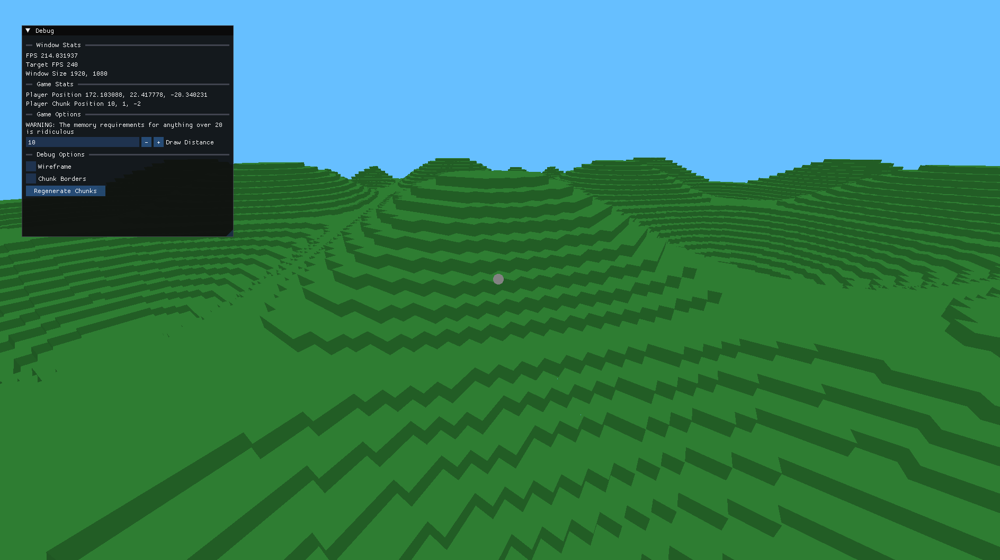

# VoxelX

A small voxel engine written in C.



## Features

Currently not much, simple block breaking and placing with infinite world 
generation.
Does feature infinite build height as well as infinite depth, however the world 
does not currently generate to these extremes.

## Building

The project uses CMake, which should make it easy to build on any platform. 
However, right now ImGui, cimgui, and rlImGui are all built into a single static
library and the extent of my testing has been on Windows and WSL. Apple Silicon
isn't supported because I have not built an arm64 version of the library.
If you wish, you are welcome to build the 
libraries yourself; it should work just fine.

### Windows
This is specific to your IDE, please refer to your IDE's CMake documentation
for more information.

### Linux & MacOS(intel)
```
mkdir build
cd build
cmake ..
make
./VoxelX
```

## Dependencies

All dependencies are either included in the project or will be downloaded when 
builds.

Here are all the libraries used:

- [raylib](https://github.com/raysan5/raylib)
- [rlImGui](https://github.com/raylib-extras/rlImGui)
- [cimgui](https://github.com/cimgui/cimgui)
- [imgui](https://github.com/ocornut/imgui)
- [tinycthread](https://github.com/tinycthread/tinycthread) - Unused for now

## License

[MIT](https://choosealicense.com/licenses/mit/)